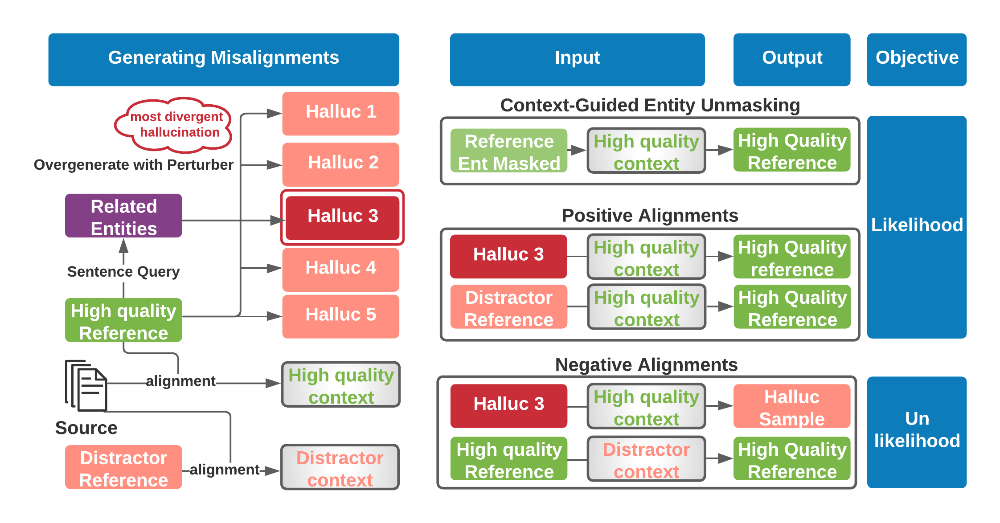

# ReviseSum

This is the README for the paper "Learning to Revise References for Faithful Summarization" by Griffin Adams, Han-Chin Shing, Qing Sun, Christopher Winestock, Kathleen McKeown, and Noémie Elhadad.  This research was done while Griffin (PhD student at Columbia University) was an intern with the [Amazon Comprehend Medical](https://aws.amazon.com/comprehend/medical/) team.

If you have any questions about the paper or code, please feel free to contact griffin.adams@columbia.edu or raise an issue on GitHub.

## High-Level Approach

We propose a new approach to improve reference quality which involves revising--not remove--unsupported reference content. Without ground-truth supervision, we construct synthetic unsupported alternatives (`/perturber`) to supported sentences and use contrastive learning to discourage/encourage (un)faithful revisions (`/ref_reviser`). At inference, we vary style codes to over-generate revisions of unsupported reference sentences and select a final revision which balances faithfulness and abstraction. We extract a small corpus from a noisy source (`/preprocess`)--the MIMIC-III clinical notes from the EHR--for the task of summarizing a hospital admission from multiple notes. We fine-tune BART and Longformer models on original, filtered, and revised data (`/gen_transformers`), and find that training on revised data is the most effective data-centric intervention for reducing hallucinations.

A high-level diagram of the revision training strategy is shown below.



## Code Setup

```
pip install -e .
```

To be able to run models and sync results, you will need to create an account on [Weights & Biases](https://wandb.ai/).  Otherwise, please run all models with `-offline` flag.

```
pip install wandb
wandb login
```

## Overview

Please see separate READMEs for

1. Preprocessing MIMIC-III data into a hospital-course summarization corpus (`/preprocess`).  NB: You will need to request access from PhysioNet to download the raw data using this [link](https://physionet.org/works/MIMICIIIClinicalDatabase/access.shtml).

2. Learning to generate synthetic hallucinations with BART (`/perturber`).

3. Learning to revise unsupported reference sentences with contrastive learning (`/ref_reviser`).

4. Running summarization models (BART and Longformer) on MIMIC-III revised, original, and filtered references (`/gen_transformers`).  Also provides flags to train by controlling hallucinations ([Fillippova, 2020](https://aclanthology.org/2020.findings-emnlp.76.pdf)) and with Loss Truncation ([Kang and Hashimoto, 2020](https://aclanthology.org/2020.acl-main.66/)).
